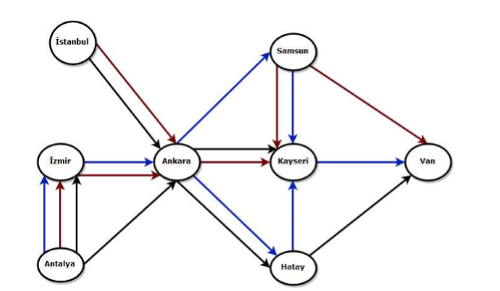

# transportation-service-in-java
A transportation system which includes airway, railway, and highway is implemented in Java.

With this application, a transportation system like in the figure below can be implemented with the different inputs.

### Input file format
You can create your own transportation system with the input file format below:

Airway	 
City1 00000000 
City2 00100000 
City3 00000110 
City4 01000000 
City5 00000001 
City6 00001000 
City7 00001000 
City8 00000000 								
 
Highway 				
City1 00000000 
City2 00100000 
City3 00000110 
City4 01000000 
City5 00000001 
City6 00001000 
City7 00001000 
City8 00000000 
 
Railway 				
City1 00000000 
City2 00100000 
City3 00000110 
City4 01000000 
City5 00000001 
City6 00001000 
City7 00001000 
City8 00000000 
 

### Queries
There are 5 different queries can be executed in this application. You can find the formats of the queries below:

#### Q1 City1 City2 N Type
City1 is the source and City2 is the destination, Type indicates Airway, Railway, or Highway, the scalar N indicates that at least N times the transportation type should be used to read the destination city from the source.

#### Q2 City1 City2 City3
City1 is the source, City2 is the destination and C3 is the intermediate city. This query outputs the path from the source city to the destination by passing through the intermediate city.

#### Q3 City1 City2 Type
City1 is the source, City2 is the destination city and Type indicates that either Airway or Railway or Highway. This query outputs the path from the source city to the destination city only using the indicated transportation type.

#### Q4 City1 City2 A{a} H{h} R{r}
City1 is the source, City2 is the destination city. A indicates Airway, H indicates Highway, and R indicates Railway. This query outputs the paths from the source city to the destination city using all the indicated transportation types

For instance, 'Q4 Berlin Frankfurt A3 H1 R0' means that the source city is Berlin; the destination is Frankfurt, and you must use 3 airways route, 0 railway route, 1 highway route to reach Frankfurt. It is not important order of the type of transportation (A3-H1-R0). 

#### PRINTGRAPH
This query outputs the graph structure. For instance:

Berlin --> Frankfurt  
Munich --> Dresden  
Frankfurt -->  Freiburg Stuttgart Ulm
Freiburg --> Munich Zurich  

## Motivation
This application is developed to comprehend the directed graph data structure. And the queries that I executed helped me to enhanced my algorithmic approach.
